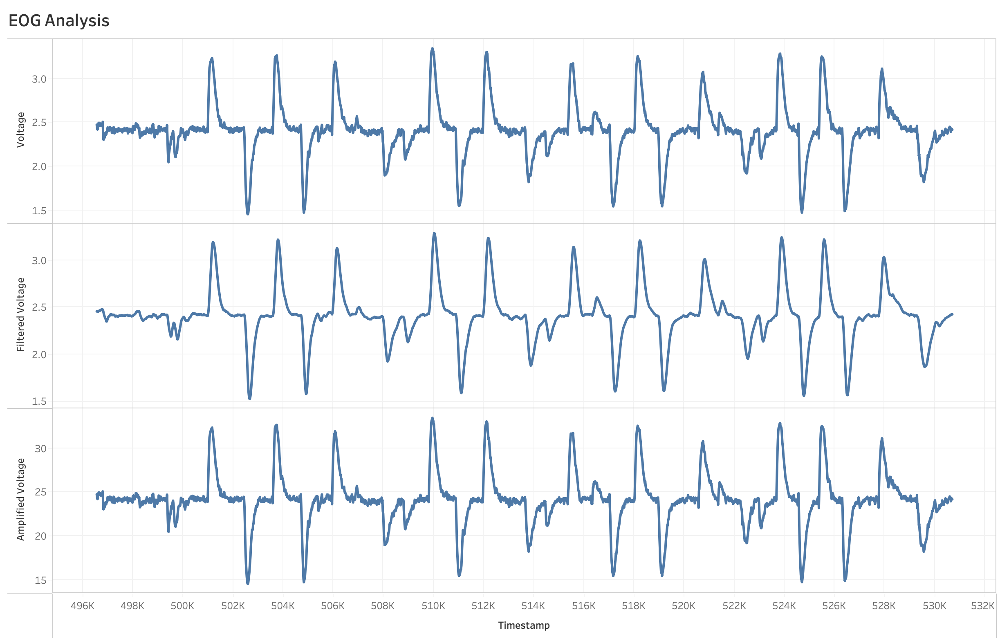

# Eye Movement Analysis for Lazy Eye Detection (amblyopia)

This project focuses on analyzing eye movements to detect conditions like lazy eye (amblyopia). The system captures and processes signals to analyze saccades and blink patterns, providing tailored exercises for prevention and treatment.  

## Features  
- **Signal Capture:** Utilizes Arduino and ESP32 microcontroller for efficient data acquisition.  
- **BioAmp EXG Pill:** Tracks eye movement patterns with precision.  
- **Real-time Analysis:** Processes saccades and blink patterns to identify irregularities.  
- **Assistive Exercises:** Generates personalized exercises to address detected issues.

## Analyzed signal aquasition
  

## Hardware Components  
- **ESP32 Microcontroller**  
- **BioAmp EXG Pill**  
- **ADS1115 16-bit ADC Module**  
- **830 Points Breadboard**  

## Software Requirements  
- Arduino IDE  
- Python (for data analysis and machine learning model training)  
- Required libraries for ESP32 and BioAmp EXG  

## Getting Started  
Install necessary libraries in Arduino IDE and Python.
Connect the hardware as per the provided circuit diagram.
Upload the Arduino code to the ESP32.
Run the Python script for data processing and analysis.
Future Scope

Expand to assist individuals with other vision impairments.
Develop an integrated AI system for advanced diagnostics.
Contributing

Contributions are welcome! Please fork the repository, create a branch, and submit a pull request.

## License

This project is licensed under the Apache License 2.0

## Acknowledgments

Special thanks to the creators of BioAmp EXG and all open-source contributors.
